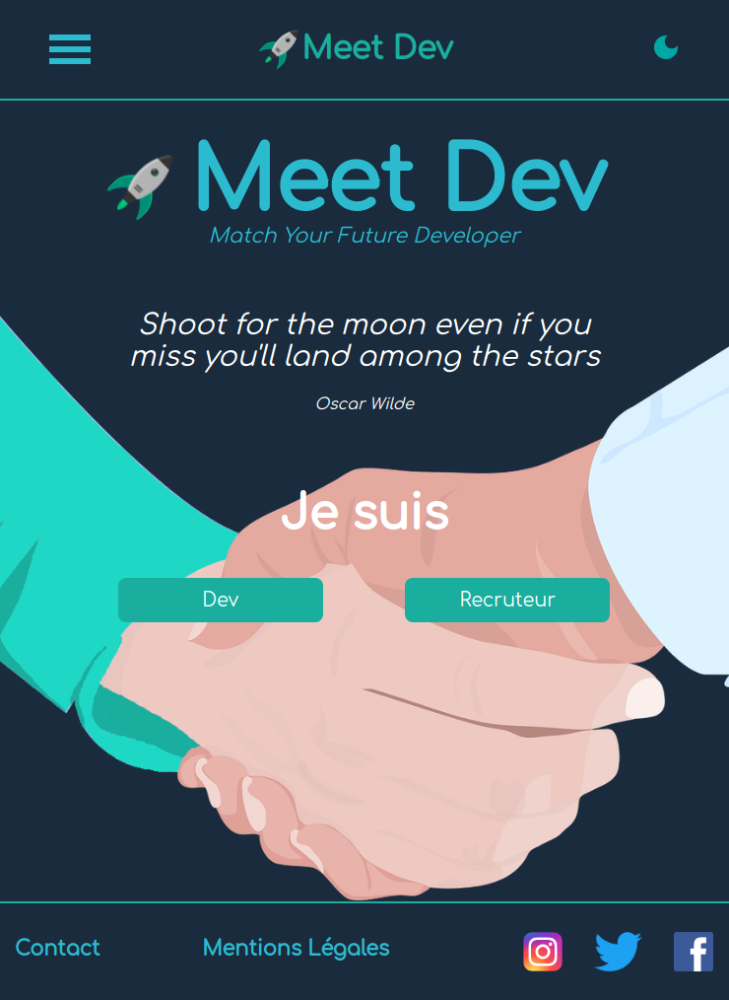

# MeetDev
Welcome in MEETDEV code, a project realized by :

- Christophe BROCARD
- Henri TEINTURIER
- Alejandra RAFART
- Alicia MILEKIC
- Sébastien WILK

This is our graduation project. On the front we had Henri as leadDev and Christophe and Sebastien. For the back Alicia(leadback) and Alejandra.

We worked with React, Redux, framer-motion, Scss on the front side. For the back we used Lumen (Laravel). here, we are in the front-part of the code.

the spirit of meetdev is facilitate relationships and meetings between developers and recruiters.

## Documentation

The documentation is available in the [docs directory](./docs/)

